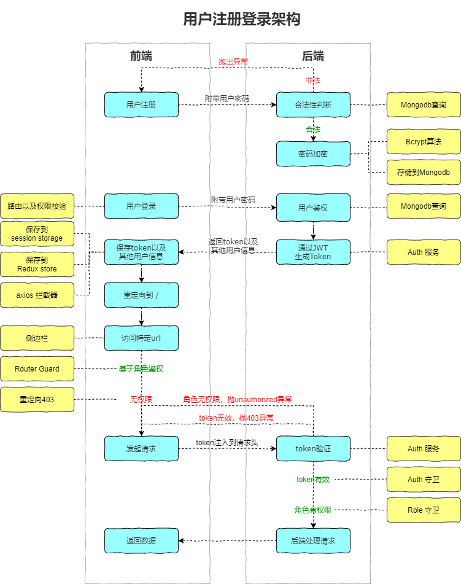
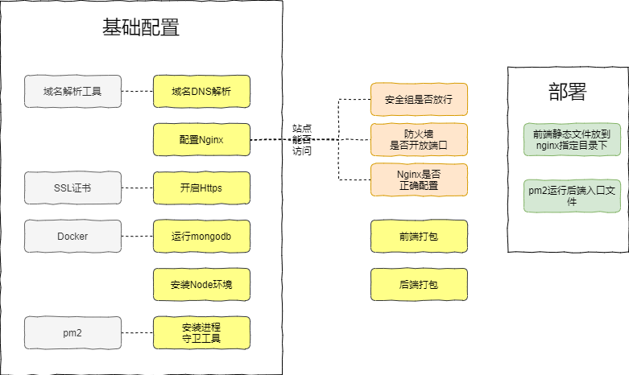

# 01 - 由用户登录而来的 JWT 鉴权，权限管理

## 前言

> 当一个新手学习 React 想要找一个练手的项目，结果市面上开源的都是各种 TODO App，甚至于 Real World 系列也差强人意。付费课程大多也很难详尽地讲清楚方方面面。同时，Admin, dashboard 之类的中后台的需求日愈旺盛，值得前端开发者多多关注。于是就有了[React Nest Admin](https://github.com/cnscorpions/React-Nest-Admin)的产生，本文是其系列文章**手把手带你撸一个前后端分离的 Admin 项目**的开篇文章

## 谁适合食用?

- 想要掌握 JWT 鉴权，权限管理（前后端）
- 想了解真实项目上线
- 不适合全栈

## 技术栈

本项目前端基于 CRA 搭建，技术栈涉及 es6+, react, react-router, react-redux（以及 redux-devTools, redux-thunk, react-persist 等中间件），axios 和 ant design of react，sass, CSS Module 等等，后端基于 nest-cli 搭建，技术栈涉及 Typescript, nest.js 及其中间件，mongodb, mongoose, rxjs 等等，运维涉及 MEAN 环境搭建（涉及到 Nginx 的偏多），PM2 部署 node 应用。

## 为什么不用 antd pro

- 不喜欢 antd pro + umi + dva 的绑定（尽管它们很优秀）
- antd pro 内容太多，初学者拿来学习中后台开发难以找到头绪
- 从零打造一个 admin 系统，一点点优化处来，有成就感，也顺手一些

## 为什么使用 Nest.js

- 全面支持 Typescript
- 基于 Express.js，方便使用其丰富的中间件生态
- 受 Angular 启发的**架构**
  > while plenty of superb libraries, helpers, and tools exist for Node (and server-side JavaScript), none of them effectively solve the main problem of - Architecture. Nest provides an out-of-the-box application architecture which allows developers and teams to create highly testable, scalable, loosely coupled, and easily maintainable applications - **By Nest.js Official**

## 一分钟了解 Nest.js 核心概念

熟悉 Angular 的朋友看下 Nest.js 官方的 Overview 就可以愉快地 CRUD 了，不熟悉的朋友了解一下几点就可以了：

- 通过模块树来组织应用结构
  
- controller, module, service 是 Nest 三剑客，是基础要素，controller 负责处理入站请求，返回相应到客户端，module 实现某功能封装，把业务逻辑放到 service 里进行处理，service 可以通过依赖注入到 controller 和其他 service 中去
- Express.js 是一个基于 middleware 的中间件，所以 Nest 也是。像 Guards, Filters, Interceptors 等等实际上都是 middleware，只是具有不用功能，且执行顺序不同
  

> 学习 Nest Tips:
>
> 1. 反复阅读[Nest 官方文档](https://docs.nestjs.com)，因为它的资料不算多
> 2. 代码示例可以参考[Nest Sample](https://github.com/nestjs/nest/tree/master/sample)，搭配 Octotree 食用更佳，非常全面
> 3. 遇到问题，可以依照 stackoverflow --> issues 区 ---> Nest Discord 服务器，寻找解决办法

## 步骤

1. 前后端项目初始化

   ```
   # 强烈建议换源头，同时安装nrm方便切换registry
   # 建议安装nvm，实现多版本node安装

   # 通过cra脚手架安装
   npx create-react-app admin-fe

   # 安装nest li
   npm i -g @nestjs/cli

   # 创建新的项目
   nest new admin-be

   ```

2. 前端删除包括 serviceWorker 在内的多余文件
3. 前端[配置 prettier](https://create-react-app.dev/docs/setting-up-your-editor/)
4. 前端添加 Antd
   > 因为 antd v3 中打包会把所有图标都搭进去，造成 bundle 会特别大，所以建议安装 v4 版本，从 v3 升级到 v4 让人一言难尽。[点我直达 antd 文档](https://ant-design.gitee.io/docs/react/migration-v4-cn)
5. 前端使用 reset-css 重置样式，样式方案选择 Sass + CSS module
   > 关于 react 的样式方案有很多，Vanilla Css, CSS module, Css in JS，选择 CSS module 的原因是使用非常简单，可以看这篇文章 - [CSS Modules 详解及 React 中实践](https://github.com/camsong/blog/issues/5)

### 前端路由分类以及实际应用

根据 react-router 官方的说法，他们把前端路由分为 Static Routing 和 [Dynamic Routing](https://reacttraining.com/react-router/web/guides/philosophy/nested-routes) 如下：

> In these frameworks, you declare your routes as part of your app’s initialization before any rendering takes place.

所以，Static Routing 指的是在 rendering 发生前定义 routes，给个 express.js 示例：

    ```
    app.get("/", handleIndex);
    app.get("/invoices", handleInvoices);
    app.get("/invoices/:id", handleInvoice);
    app.get("/invoices/:id/edit", handleInvoiceEdit);

    app.listen();
    ```

Dynamic Routing 意味着 Router 作为组件存在，在 rendering 过程中生效，示例如下：

    ````
    import { BrowserRouter as Router } from "react-router-dom";

    ReactDOM.render(
        <Router>
            <App />
        </Router>, el);

    const App = () => (
        <div>
            <nav>
            <Link to="/dashboard">Dashboard</Link>
            </nav>
        </div>
    );
    ```

关于 Nested Routes 和 Responsive Routes，动态路由都有非常好的表现。如果使用过 umijs 的朋友都会知道，umi 中支持配置式路由和约定式路由，其中配置式路由也就是动态路由，只不过把 router config 抽出到一个单独的 js 文件中，约定式路由也叫文件路由，就是不需要手写配置，文件系统即路由，通过目录和文件及其命名分析出路由配置，应该是借鉴了 next.js 的。

6. 创建路由配置文件 router.config.js

   ```
    import React from "react";
    import { Link } from "react-router-dom";
    import Loadable from "react-loadable";
    import Loading from "./Loading";

    // 使用react-Loadable来做代码拆分
    const Home = Loadable({
        loader: () => import("pages/Home/Home"),
        loading: Loading,
        delay: 300
    });
    const Charts = Loadable({
        loader: () => import("pages/Charts/Charts"),
        loading: Loading,
        delay: 300
    });

    ...

   ```

   > 为什么使用 react-Loadabl 而不用 suspense, lazy 做 code splitting？使用 suspense，当网速足够快, 数据立马就获取到了，页面会闪一下，这是因为加载 loading 了，而[maxDuration 属性只有在 Concurrent Mode](https://juejin.im/post/5c7d4a785188251b921f4e26)下才能使用

7. 前端配置路由守卫

   ```
    // src/router/RouteGuard.jsx
    import React from "react";
    import { Route, Redirect, useLocation } from "react-router-dom";
    import { checkPermission } from "./checkPermission";

    function PrivateRoute({ children, ...rest }) {
    let location = useLocation();
    let { isAuth, definedRoles } = { ...rest };

    // 权限不足跳转（已登录）
    checkPermission(isAuth, definedRoles, location.pathname);

    // 未认证跳转
    return (
        <Route
        {...rest}
        render={({ location }) =>
            isAuth ? (
            children
            ) : (
            <Redirect
                to={{
                pathname: "/login",
                state: { from: location }
                }}
            />
            )
        }
        />
    );
    }

    export default PrivateRoute;

    // src/router/checkPermission.js
    import React from "react";
    import { Redirect } from "react-router-dom";
    import { getRoles } from "utils/storage";

    export const checkPermission = (isAuth, definedRoles, pathname) => {
        if (isAuth && getAuthorizedState(definedRoles, pathname)) {
            return <Redirect to={{ pathname: "/not-allow" }} />;
        }
    };

        const getAuthorizedState = (definedRoles, pathname) => {
        // 不需要认证路径
        const isNotAuthedPath = ["/login", "/not-found", "/not-allow"].find(
            path => path === pathname
        );

        let roles = getRoles() || [];

        // 条件为认证路径下，前端获取的roles数组非空，并且包含在路由定义的数组中
        return (
            !isNotAuthedPath &&
            (!roles || !roles.every(role => !!definedRoles.find(item => item === role)))
        )
    };
   ```

8. 用户注册

   ```
   // user.controller.ts 处理/user/signup的POST请求
   import { Controller, Post } from '@nestjs/common';

   @Controller('user')
   export class UserController {

        // 注册
        @Post("signup")
        async signup(@Body() Body) {
            const data = await this.userService.createUser(Body);
            return data;
        }
   }

   // user.service.ts 注册逻辑
   export class UserService {
    constructor(
        @InjectModel("User") private readonly userModel: Model<User>
    ){}

        // 注册处理逻辑
    async createUser(userDto: UserDto): Promise<any> {
        const { username, password, roles = ["user"], isEnabled = false } = userDto;
        // 从mongodb根据username查询user
        const user = await this.findUser(username);
        console.log("user", user);
        // 验证用户是否存在（不能为admin）
        if (user) {
        throw new HttpException(
            {
            status: HttpStatus.FORBIDDEN,
            error: "用户已经存在"
            },
            403
        );
        } else if (username === "admin") {
        throw new HttpException(
            {
            status: HttpStatus.FORBIDDEN,
            error: "无权注册admin"
            },
            403
        );
        }

        // 给用户加密
        const hashPwd = await this.encryptService.getEncrypted(password);
        // 创建user（admin用户此方法无法创建）
        const newUser = new this.userModel({
        username: username,
        password: hashPwd,
        roles: roles,
        isEnabled: isEnabled
        });
        await newUser.save();
        return `注册${username}成功！`;
    }
   }
   ```

## 用户登录流程图



## 应用上线流程图



## 参考文档

1. [Nest 官方文档](https://docs.nestjs.com/)
2. [create-react-app 配置 prettier](https://create-react-app.dev/docs/setting-up-your-editor/)
3. [Antd v3 升级 v4](https://ant-design.gitee.io/docs/react/migration-v4-cn)
4. [CSS Modules 详解及 React 中实践](https://github.com/camsong/blog/issues/5)
5. [React Router 设计哲学](https://reacttraining.com/react-router/web/guides/philosophy/nested-routes)
6. [suspense maxDuration 属性只有在 Concurrent Mode 下使用](https://juejin.im/post/5c7d4a785188251b921f4e26)
